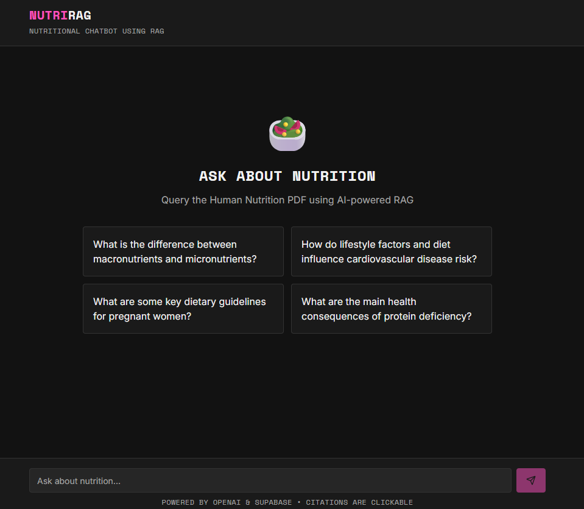
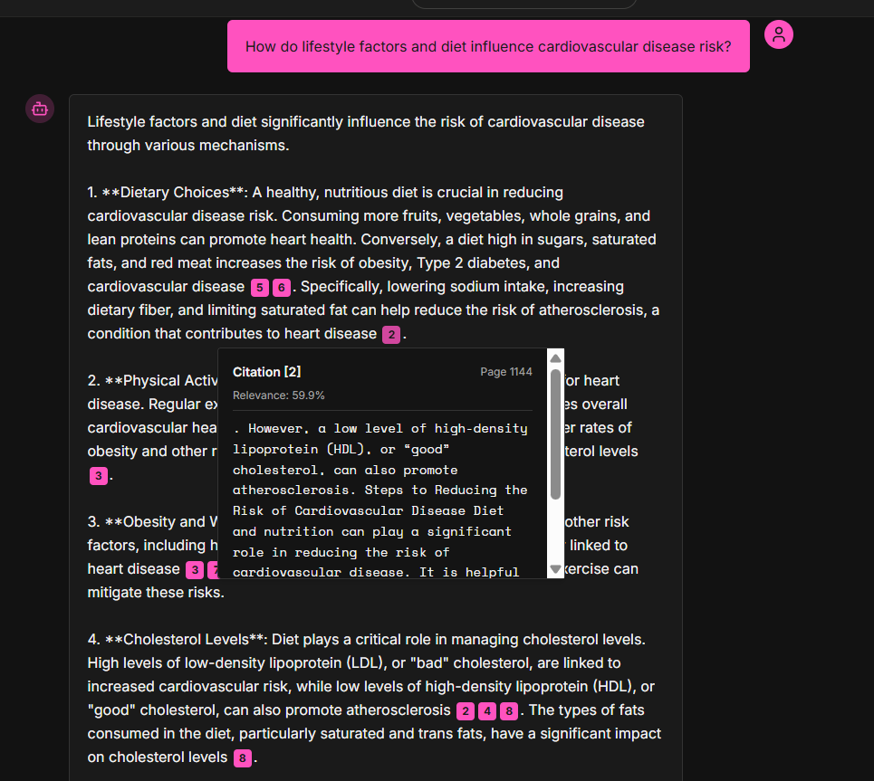
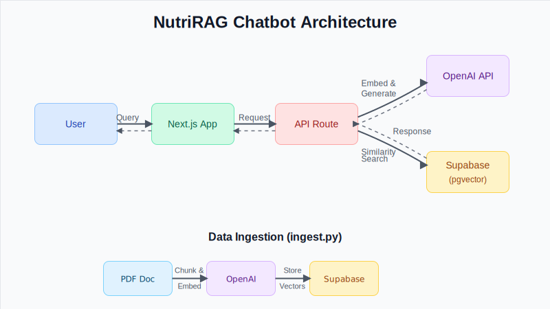

# NutriRAG Nutrition Chatbot

This project is a Retrieval Augmented Generation (RAG) based chatbot that answers questions about human nutrition. It uses a PDF on human nutrition as its knowledge base. The backend is built with Python, OpenAI for embeddings, and Supabase for the vector store. The frontend is a chat interface built with Next.js and Tailwind CSS.

## Screenshots

Here are some screenshots of the application:





## Architecture

The following diagram illustrates the architecture of the NutriRAG chatbot:



## Project Structure

-   `ingest.py`: This script processes the `Human-Nutrition-text.pdf`, creates embeddings using OpenAI's `text-embedding-3-small` model, and stores them in a Supabase vector database.
-   `test_embeddings.py`: A script to test the embeddings by querying the Supabase database.
-   `rag-chat/`: This directory contains the Next.js frontend for the chatbot.
-   `requirements.txt`: The Python dependencies for this project.

## How it works

1.  **Data Ingestion**: The `ingest.py` script reads the `Human-Nutrition-text.pdf`, splits it into smaller chunks, and generates vector embeddings for each chunk using OpenAI's API. These embeddings are then stored in a Supabase Postgres database with the `pgvector` extension.
2.  **Question Answering**: When a user asks a question, the Next.js frontend sends the query to a backend API. The backend generates an embedding for the user's question and queries the Supabase database to find the most relevant text chunks from the nutrition textbook.
3.  **Generating a Response**: The retrieved text chunks and the original question are then passed to an OpenAI language model to generate a comprehensive and accurate answer.


## Getting Started

### Prerequisites

-   Python 3.8 or higher
-   Node.js and npm
-   An OpenAI API key
-   A Supabase account

### Installation

1.  **Clone the repository:**
    ```bash
    git clone https://github.com/your-username/NutriRAG_Nutrition_chatbot.git
    cd NutriRAG_Nutrition_chatbot
    ```
2.  **Set up the backend:**
    -   Install the required Python packages:
        ```bash
        pip install -r requirements.txt
        ```
    -   Create a `.env` file in the root directory and add your OpenAI and Supabase credentials:
        ```env
        OPENAI_API_KEY="your-openai-api-key"
        SUPABASE_URL="your-supabase-url"
        SUPABASE_SERVICE_ROLE_KEY="your-supabase-service-role-key"
        ```
    -   Run the `ingest.py` script to process the PDF and populate your Supabase database:
        ```bash
        python ingest.py
        ```
3.  **Set up the frontend:**
    -   Navigate to the `rag-chat` directory:
        ```bash
        cd rag-chat
        ```
    -   Install the required npm packages:
        ```bash
        npm install
        ```
    -   Create a `.env.local` file in the `rag-chat` directory and add your OpenAI and Supabase credentials.
    -   Start the development server:
        ```bash
        npm run dev
        ```
    -   Open [http://localhost:3000](http://localhost:3000) in your browser to see the running application.

## Usage

Once the application is running, you can ask questions about human nutrition in the chat interface. The chatbot will use the information from the textbook to provide detailed answers.